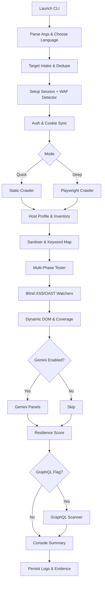
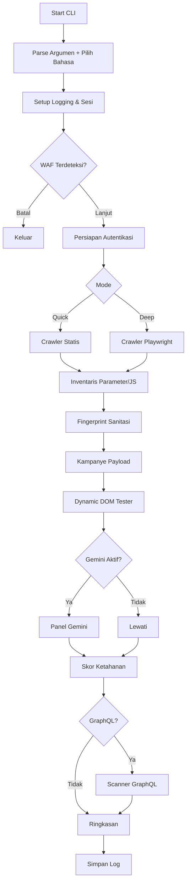

<div align="center">


[](https://github.com/merdekasiberlab/xsscanner)

</div>

---

# XSSSGENAI – English Edition

> **Mission**: Deliver a repeatable, insight-rich XSS assessment on modern applications by blending context-aware payloads, adaptive crawling, WAF intelligence, and Gemini-assisted triage.

## Contents
1. [Quick Facts](#1-quick-facts)
2. [Core Capabilities](#2-core-capabilities)
3. [Architecture & Module Map](#3-architecture--module-map)
4. [Processing Pipeline](#4-processing-pipeline)
5. [Installation & Environment Setup](#5-installation--environment-setup)
6. [Configuration & Extensibility](#6-configuration--extensibility)
7. [Operating the CLI](#7-operating-the-cli)
8. [Payload & Testing Strategy](#8-payload--testing-strategy)
9. [WAF-Aware Workflow](#9-waf-aware-workflow)
10. [Gemini AI Companion](#10-gemini-ai-companion)
11. [Resilience Metrics & Reporting](#11-resilience-metrics--reporting)
12. [Logs, Data Hygiene & Export](#12-logs-data-hygiene--export)
13. [Troubleshooting & FAQ](#13-troubleshooting--faq)
14. [Roadmap & Contributions](#14-roadmap--contributions)
15. [Legal Notice](#15-legal-notice)

---

## 1. Quick Facts
| Item | Details |
|------|---------|
| Product Name | **XSSSGENAI** (MerdekaSiberLab Access-X initiative) |
| Focus | Cross-Site Scripting discovery, verification, and prioritisation |
| Supported Targets | SSR, SPA, and hybrid applications (desktop or mobile web) |
| Execution Modes | `quick` (static crawler) / `deep` (Playwright crawler) |
| Languages | English & Bahasa Indonesia (selectable at launch) |
| AI Integration | Optional Google Gemini analysis (`GENAI_API_KEY`) |

## 2. Core Capabilities
- **Hybrid Crawling** - deterministic HTML traversal plus Playwright-driven sessions for SPA states, gated flows, and dynamic components.
- **Host Profiling & Surface Prioritisation** - `host_profile.py` scores frameworks, sink hints, and recurring parameters to focus fuzzing where XSS is likeliest.
- **Sanitisation & Keyword Fingerprinting** - `sanitization_analyzer.py` classifies character handling, event mangling, and URI scheme stripping to shape payload mutations.
- **Multi-Stage Payload Engine** - `payload_strategy.py` and `tester_phases.py` drive a seven-phase campaign (headers, stored, path/fragment, CSP-aware, progressive, coverage-guided, static brute) before escalation.
- **Dynamic DOM Tester & Coverage** - `dynamic_dom_tester.py` plus CDP coverage capture runtime sinks, event wiring, and execution traces that seed payload selection.
- **Blind XSS & OAST Observability** - `oast.py` issues multi-vector beacons and polls SSE/HTTP endpoints for stored or delayed execution hits.
- **WAF Detection & Bypass Guidance** - `waf_detector.py` cross-references headers, cookies, and body markers to identify vendors, throttle limits, and bypass tips.
- **Gemini Intelligence Layer** - `ai_analysis.py` builds multi-part prompts for Google GenAI, outputting ranked sinks, exploit ladders, and mitigations backed by runtime context.
- **GraphQL Reconnaissance** - `graphql_scanner.py` discovers endpoints, performs introspection, and fuzzes resolver arguments for XSS surfaces.
- **Resilience Scoring & CSP Ladder** - `resilience.py` and tester telemetry quantify CSP/Trusted Types posture, ladder probes, and sink hygiene.
- **CSP Bypass Catalog** - `tools/csp_bypass` matches observed `script-src` hosts with known JSONP/script gadget payloads during Phase 4.
- **Performance Boosters** - `fastreflect_worker.py` and the optional Playwright browser pool accelerate reflection checks, decoding, and evidence capture.
- **Multi-Target Intake** - CLI scheduler ingests URL lists, STDIN streams, and raw proxy requests while sharing cookies and session state across workers.

## 3. Architecture & Module Map
```
cli.py                  # CLI UX, orchestration, language selection
main.py                 # Entry shim
network.py              # Session handling, retries, pacing, WAF throttle
waf_detector.py         # Fingerprints + bypass planner
host_profile.py         # Host scoring & parameter frequency tracking
sanitization_analyzer.py# Reflection fingerprinting & keyword probes
payload_strategy.py     # Context fingerprinting & payload generation
tester.py               # Pipeline orchestrator & resilience aggregation
tester_phases.py        # Phase logic (headers, stored, CSP, OAST, coverage)
tester_browser.py       # Playwright helpers for execution confirmation
tester_ui.py            # Rich console formatting & progress widgets
fastreflect_worker.py   # Optional native helper for fast decode/contains checks
dynamic_dom_tester.py   # Playwright instrumentation for runtime sinks
resilience.py           # CSP ladder probes & defensive scoring
ai_analysis.py          # Gemini prompts, Rich rendering
graphql_scanner.py      # Endpoint enumeration & resolver fuzzing
oast.py                 # Blind XSS token generation & polling helpers
crawler/                # Static BFS + advanced Playwright crawlers
parsers/                # Context parsers (HTML, attributes, JS, DOM)
tools/csp_bypass/       # CSP gadget dataset + matching helpers
tools/fastreflect/      # Go-based fastreflect binary source
docs/                   # Extra documentation & evaluation artefacts
waf_fingerprints.yaml   # Vendor signatures
i18n.py                 # Translation registry and helper utilities
```

### 3.1 Module Responsibilities
| Module | Inputs | Core Logic | Outputs |
|--------|--------|------------|---------|
| `cli.py` | CLI args, language selection | Orchestrates scan workflow, renders Rich UI | Payload results, AI panels, resilience summary |
| `network.py` | Session config, WAF profile | Request pacing, jitter, retry/backoff | HTTP responses with enforced throttle |
| `waf_detector.py` | Response headers, bodies | Fingerprints vendor traits & bypass tactics | WAF plan (throttle, payload hints) |
| `host_profile.py` | HTML bodies, JS URLs, parameters | Scores framework/sink hints per host | Parameter priority scores |
| `sanitization_analyzer.py` | Probe payloads, HTTP responses | Maps character handling & keyword mangling | Sanitiser map + keyword status |
| `payload_strategy.py` | Sanitiser map, WAF hints | Tailors payload templates per context | Context-specific payload sets |
| `dynamic_dom_tester.py` | Target pages, Playwright context | Runs headless evaluation, captures sinks | Runtime findings (events/mutations) |
| `tester.py` | Payload sets, runtime data | Orchestrates multi-phase campaign, tracks hits | Confirmed vulns, resilience signals |
| `tester_phases.py` | Target spec, engine, runtime hints | Executes phased attacks (headers, stored, CSP, OAST, coverage) | Phase outcomes, revisit tasks |
| `tester_browser.py` | Playwright page/context | Confirms execution & manages CDP hooks | Evidence screenshots, coverage traces |
| `tester_ui.py` | Progress events, console | Thread-safe Rich formatting & prompts | Status tables, panels, prompts |
| `ai_analysis.py` | HTML snapshots, JS snippets, runtime JSON | Assembles Gemini prompt & renders Rich panels | Sectioned analysis (summary, exploit paths, etc.) |
| `resilience.py` | Rendered HTML, CSP headers | Runs ladder probes & framework detection | Resilience report + score |
| `graphql_scanner.py` | Base URL, session | Enumerates endpoints, introspects schema | GraphQL findings & fuzz results |
| `fastreflect_worker.py` | Strings for decode/search | Provides native decode/contains operations | Low-latency reflection checks |
| `tools.csp_bypass` | CSP source list | Matches hosts with gadget dataset | CSP bypass payload candidates |
| `oast.py` | OAST base URL, provider config | Generates beacons & polls for callbacks | Blind-XSS detections & tokens |

## 4. Processing Pipeline
1. **Input & Language Selection** - parse CLI flags, merge multi-target sources, and set translation scope via `_prompt_language_choice()`.
2. **Logging & Telemetry** - initialise Rich console/file logging, respecting `--summary-only` when a quiet run is requested.
3. **Target Intake** - combine `--url`, `--urls-file`, `--stdin`, and `--raw-request` payloads, dedupe origins, and normalise schemes before scheduling.
4. **Session & WAF Fingerprinting** - prepare `network.session` (cookies, proxies, UA jitter) and run `WAFDetector.detect()` to extract vendor metadata, throttling caps, and bypass hints.
5. **Authentication & Cookie Sync** - perform manual Playwright login (`--manual-login`) or scripted selector login; persist storage state and feed cookies back to the requests session.
6. **Crawling & Host Profiling**
   - *Quick Mode*: static BFS enumerates anchors/forms/scripts up to depth and URL limits.
   - *Deep Mode*: Playwright crawler navigates SPA flows, records JS assets, CSRF tokens, and calls `update_host_profile()` for every response.
7. **Inventory & Prioritisation** - aggregate forms, parameters, external JS metadata, and host profile scores to decide fuzzing order per surface.
8. **Sanitisation & Keyword Fingerprinting** - `sanitization_analyzer` probes reflections, event mangling, and URI scheme filtering; `fastreflect_worker` accelerates reflection checks.
9. **Multi-Phase Tester** - `tester_phases` executes staged attacks:
   - header reflection & template probing,
   - stored/Blind-XSS beaconing via `oast.py`,
   - path/fragment & header injections,
   - CSP-aware gadget matching with `tools.csp_bypass`,
   - progressive context-aware payload sequences,
   - CDP coverage-guided payload pushes,
   - static parallel brute-force with sanitiser-driven mutations.
10. **Dynamic DOM & Coverage Harvesting** - `dynamic_dom_tester` plus Playwright coverage capture runtime sinks, event wiring, and execution traces for reporting and AI prompts.
11. **Gemini Intelligence (Optional)** - `ai_analysis` builds multi-part prompts from sanitiser maps, runtime findings, CSP data, and JS snippets, rendering Rich panels.
12. **Resilience Aggregation** - `resilience` ladder probes, Trusted Types checks, framework heuristics, and sanitiser summaries roll into a 0-100 score with actionable checklist.
13. **GraphQL Recon (Optional)** - discover endpoints, introspect schema, and fuzz resolver arguments when `--graphql` is enabled.
14. **Summary & Persistence** - collate confirmed payloads, blind hits, AI panels, screenshots/HTML captures, and structured logs under `logs/`.

### 4.1 Visual Flow


## 5. Installation & Environment Setup
### 5.1 Clone & Virtual Environment
```bash
git clone https://github.com/merdekasiberlab/xsscanner.git
cd xsscanner
python -m venv .venv
# Windows PowerShell"). .venv/Scripts/Activate.ps1"
# macOS/Linux
source .venv/bin/activate
```

### 5.2 Dependencies
```bash
pip install --upgrade pip
pip install -r requirements.txt
python -m playwright install chromium
```

### 5.3 Developer Utilities
```bash
pip install -r requirements-dev.txt
ruff check .
mypy .
pytest -m "not playwright"
```

### 5.4 Environment Variables
| Variable | Purpose |
|----------|---------|
| `GENAI_API_KEY` | Google GenAI key for Gemini integration. |
| `HTTP_PROXY`, `HTTPS_PROXY` | Proxy configuration for outbound requests. |
| `XSSCANNER_USER_AGENT` | Override default scanner user-agent string. |
| `OAST_BASE_URL` / `XSS_OOB_BASE_URL` | Override blind XSS callback collector (defaults to bundled MerdekaSiber endpoint). |

### 5.5 FastReflect (Optional)
`fastreflect_worker.py` automatically spawns `tools/fastreflect/fastreflect{.exe}` when available. A Windows binary ships with the repo; Linux/macOS users can build it with Go:
```bash
cd tools/fastreflect
go build -o fastreflect
```
The worker accelerates repeated decode/contains checks; when absent the scanner gracefully falls back to the pure-Python routine (slower on large responses).

## 6. Configuration & Extensibility
- **`config.py`** - logging paths, crawl depth/URL caps, OAST base URL, Playwright pool size, and rate-limit knobs.
- **`waf_fingerprints.yaml`** - extend to capture new vendors, throttling heuristics, or custom appliances.
- **`payloads.yml`** - merge custom payload sets per context; `SuperBypassEngine` respects your additions.
- **`tools/csp_bypass/data.tsv`** - append gadget payloads (tab-separated `Domain`, `Code`) for CSP bypass expansion.
- **`tools/fastreflect/`** - Go source for the optional decoder; customise and rebuild when adding decoding heuristics.
- **`host_profile.py` / `sanitization_analyzer.py`** - tweak framework hints, regex scoring, or keyword probes to match target stacks.
- **`i18n.py`** - add phrases when extending CLI dialogue or localisation.
- **`docs/`** - store internal evaluation notes, compliance artefacts, or run books.

## 7. Operating the CLI
### 7.1 Syntax
```bash
python main.py [OPTIONS] <target_url>
```

### 7.2 Common Options
| Flag | Description |
|------|-------------|
| `--mode {quick,deep}` | Static BFS vs Playwright crawler. |
| `--max-urls N` | Limit total discovered URLs per target. |
| `--depth N` | BFS depth guard for crawling. |
| `--payloads FILE` | Merge custom payload YAML definitions. |
| `--param name[=value]` | Seed manual parameters on the landing page (repeatable). |
| `--param-wordlist FILE` | Wordlist used to brute-force parameter names. |
| `--workers N` | Thread pool size for payload execution. |
| `--threads N` | Number of targets processed concurrently. |
| `--fast` | Skip brute-force encoding stage; rely on engine & phased bypasses. |
| `--auto-full` | Run full pipeline for each parameter without interactive prompts. |
| `--summary-only` | Condense console output to highlights and summary. |
| `--js-scope {all,first,dom}` | Filter JS analysis scope (all files, first-party only, or DOM-heavy). |
| `--graphql` | Enable GraphQL reconnaissance and fuzzing. |
| `--cookie "key=value;..."` | Inject baseline Cookie header. |
| `--cookie-file PATH` | Persist Playwright cookies/storage between runs. |
| `--manual-login` | Launch headful browser to capture authenticated session. |
| `--login-url URL` | Force navigation to login page before manual capture. |
| `--username`, `--password` | Scripted credentials for automatic login. |
| `--user-selector`, `--pass-selector`, `--submit-selector` | CSS selectors for scripted login fields/buttons. |
| `--api-key KEY` | Provide Gemini key (overrides `GENAI_API_KEY`). |
| `--insecure` | Disable TLS verification for HTTP requests. |
| `--urls-file FILE` | Load additional targets from newline-delimited file. |
| `--stdin` | Read targets from STDIN (one URL per line). |
| `--raw-request FILE|-` | Parse raw HTTP request(s) and build attack surfaces. |
| `--oob-provider {internal,interactsh,xsshunter}` | Select Blind-XSS callback backend. |

### 7.3 Cookbook Workflows
1. **Rapid Recon**
   ```bash
   python main.py --mode quick --max-urls 60 --depth 4 https://target.tld
   ```
2. **Deep Scan + Manual Login + GraphQL**
   ```bash
   python main.py \
     --mode deep \
     --manual-login \
     --login-url https://portal.tld/login \
     --cookie-file corp-session.json \
     --graphql \
     --max-urls 150 \
     --depth 6 \
     https://portal.tld
   ```
3. **Gemini Triage Session**
   ```bash
   set GENAI_API_KEY=your-google-genai-key
   python main.py --mode deep --api-key %GENAI_API_KEY% https://app.tld
   ```
4. **Blind XSS Sweep with Interactsh**
   ```bash
   python main.py --mode deep --oob-provider interactsh --auto-full --fast --threads 2 --urls-file bugbounty.txt
   ```
5. **Replay Proxy Capture**
   ```bash
   python main.py --raw-request burp-login.txt --mode deep --auto-full --graphql
   ```

### 7.4 JS Analysis Menu
- Ranked by sink count, context diversity, and file size.
- Options: quick summary, full Gemini review, or skip per file.
- Quick summary displays top sink labels and truncated snippets.

### 7.5 Multi-Target Intake
Targets from `--url`, `--urls-file`, `--stdin`, and `--raw-request` are normalised, deduplicated, and scheduled according to `--threads`. Shared cookies and storage state travel across targets that belong to the same origin.

### 7.6 Raw Request Replay
`--raw-request` accepts Burp/ZAP exports (or `-` for STDIN), parses headers/body via `utils.parse_raw_http_request()`, then reconstructs forms, JSON payloads, and query parameters for replay against the live application.

### 7.7 Blind XSS Providers
`--oob-provider` switches beacon endpoints:
- `internal` (default) uses the bundled SSE/HTTP collector shipped with XSSSGENAI.
- `interactsh` reads environment variables such as `INTERACTSH_BASE_URL`, `INTERACTSH_POLL_URL`, `INTERACTSH_AUTH_HEADER`, `INTERACTSH_AUTH_VALUE`, `INTERACTSH_POLL_ATTEMPTS`, and `INTERACTSH_POLL_INTERVAL`.
- `xsshunter` honours `XSSHUNTER_BASE_URL`, `XSSHUNTER_POLL_URL`, `XSSHUNTER_TOKEN`, `XSSHUNTER_POLL_ATTEMPTS`, and `XSSHUNTER_POLL_INTERVAL` to authenticate HTTP polling.

## 8. Payload & Testing Strategy
- **Sanitiser Fingerprinting** - `sanitization_analyzer` maps reflected/encoded/filtered characters, detects keyword mangling, and recommends quote/encoding strategies per parameter.
- **Priority-Aware Sequencing** - host profile scores and parameter frequency inform which surfaces enter the engine first.
- **Phased Execution Ladder** - headers → stored/OAST → path/fragment → CSP gadget matching → progressive engine → coverage-guided probes → static parallel brute, halting early on success.
- **Blind XSS Instrumentation** - multi-vector beacons (script/img/css/link/fetch) paired with SSE/HTTP polling capture stored or asynchronous execution.
- **Fast Reflection & Mutation Gating** - `fastreflect_worker` and sanitiser heuristics suppress redundant payloads while still exploring viable multi-encoding variants.
- **WAF Adjustments** - throttling-aware payload pruning (short bodies, inline-handler avoidance, `javascript:` suppression) driven by detected WAF plan.
- **Dynamic Verification** - runtime events, timers, storage APIs, and navigation sinks validated via Playwright, with coverage traces feeding AI and reporting.

## 9. WAF-Aware Workflow
- Vendor metadata includes origin, confidence, challenge type, safe RPS/backoff, and header camouflage hints.
- CLI prompt surfaces WAF findings early so operators can pause before continuing on sensitive infrastructure.
- `network.py` enforces jittered rate limiting, per-origin throttle, UA rotation, and Accept-Language spoofing informed by the WAF plan.
- Payload engine honours WAF decisions (`short_payloads`, `no_javascript_url`, `reduce_inline_handlers`, `prefer_minimal_attr`) when selecting payload candidates.

## 10. Gemini AI Companion
- Prompt blends HTML snapshots, sanitiser maps, runtime findings, CSP ladder output, host profile context, and curated JS snippets.
- Rich panels summarise risk, evidence, exploit paths, payload ladders, mitigations, and validation plans aligned with phase outcomes.
- Follow-up loop reuses cached AI snapshots so additional questions or updated DOM samples are cheap to request.

## 11. Resilience Metrics & Reporting
- Score (0-100) factors CSP ladder probes, Trusted Types enforcement, sink inventories, runtime taint, and sanitiser effectiveness.
- Checklist items enumerate positives/warnings (e.g., inline script blocked, Trusted Types missing, high-risk sinks found).
- Pair resilience output with Gemini panels and exported screenshots/HTML for stakeholder-ready reporting.

## 12. Logs, Data Hygiene & Export
- Per-run logs under `logs/`; purge before sharing.
- Playwright storage (`cookies.json`, storage state) may contain secrets.
- Export Rich panels or resilience summary via copy/paste or `tee` piping.
- Blind-XSS tokens and Gemini outputs may include sensitive DOM/JS; scrub before distributing evidence bundles.

## 13. Troubleshooting & FAQ
| Problem | Resolution |
|---------|------------|
| WAF fingerprint missing | Extend `waf_fingerprints.yaml` with new regex signatures. |
| Playwright launch failure | `python -m playwright install chromium`. |
| Gemini import error | `pip install google-genai` or omit `--api-key`. |
| High false positives | Review context, tune `payloads.yml`. |
| Scan throttled by WAF | Accept suggested RPS, lower `--max-urls`, or start in quick mode. |
| Locked logs on Windows | Stop scan (Ctrl+C); file handle closes on exit. |
| `fastreflect` not found | Build via `go build -o fastreflect tools/fastreflect` or remove the worker to fall back on Python decoding. |
| Blind XSS provider warning | Set `INTERACTSH_*` or `XSSHUNTER_*` environment variables, or switch to `--oob-provider internal`. |

## 14. Roadmap & Contributions
- Upcoming: remote fingerprint sync, HTML/SARIF report exporters, automated regression harness (CI smoke tests), and richer evidence bundles (coverage diffs, DOM timelines).
- Contributions welcome: run `ruff`, `mypy`, relevant tests before PR; add translations to `i18n.py` as needed.

## 15. Legal Notice
Operate only on systems you own or have explicit written permission to test. Compliance with applicable laws, regulations, and contracts rests with you. MerdekaSiberLab and contributors disclaim liability for misuse or resulting damages.

---

# XSSSGENAI – Versi Bahasa Indonesia

> **Misi**: Menyajikan asesmen XSS yang dapat diulang dan kaya insight pada aplikasi modern melalui payload kontekstual, crawling adaptif, intelijen WAF, dan triase Gemini.

## Daftar Isi
1. [Ringkasan Singkat](#1-ringkasan-singkat)
2. [Kemampuan Inti](#2-kemampuan-inti)
3. [Arsitektur & Peta Modul](#3-arsitektur--peta-modul)
4. [Alur Proses](#4-alur-proses)
5. [Instalasi & Setup Lingkungan](#5-instalasi--setup-lingkungan)
6. [Konfigurasi & Ekstensibilitas](#6-konfigurasi--ekstensibilitas)
7. [Mengoperasikan CLI](#7-mengoperasikan-cli)
8. [Strategi Payload & Pengujian](#8-strategi-payload--pengujian)
9. [Alur Sadar-WAF](#9-alur-sadar-waf)
10. [Pendamping AI Gemini](#10-pendamping-ai-gemini)
11. [Metri Ketahanan & Pelaporan](#11-metri-ketahanan--pelaporan)
12. [Log, Kebersihan Data & Ekspor](#12-log-kebersihan-data--ekspor)
13. [Troubleshooting & FAQ](#13-troubleshooting--faq)
14. [Roadmap & Kontribusi](#14-roadmap--kontribusi)
15. [Catatan Hukum](#15-catatan-hukum)

---

## 1. Ringkasan Singkat
| Item | Detail |
|------|--------|
| Nama Produk | **XSSSGENAI** (inisiatif MerdekaSiberLab Access-X) |
| Fokus | Penemuan, verifikasi, dan prioritas celah XSS |
| Target | Aplikasi SSR, SPA, maupun hybrid |
| Mode Eksekusi | `quick` (crawler statis) / `deep` (crawler Playwright) |
| Bahasa | Inggris & Bahasa Indonesia (dipilih saat startup) |
| Integrasi AI | Opsional Google Gemini (`GENAI_API_KEY`) |

## 2. Kemampuan Inti
- **Crawling Hibrida** - traversal HTML deterministik dipadukan dengan sesi Playwright untuk SPA, alur login, dan komponen dinamis.
- **Profil Host & Prioritas Permukaan** - `host_profile.py` memberi skor framework, hint sink, serta parameter berulang agar fuzzing fokus pada titik paling berisiko.
- **Fingerprint Sanitasi & Keyword** - `sanitization_analyzer.py` memetakan perlakuan karakter, mendeteksi mangling event/URI, dan mengarahkan mutasi payload.
- **Mesin Payload Multi-Tahap** - `payload_strategy.py` dan `tester_phases.py` menjalankan tujuh fase (header, stored, path/fragment, sadar-CSP, progresif, coverage, brute statik) sebelum eskalasi.
- **Dynamic DOM Tester & Coverage** - `dynamic_dom_tester.py` plus capture CDP menangkap sink runtime, wiring event, dan jejak eksekusi untuk pemilihan payload.
- **Blind XSS & Observabilitas OAST** - `oast.py` memancarkan beacon multi-vektor dan memantau SSE/HTTP untuk mendeteksi eksekusi tersimpan atau tertunda.
- **Deteksi & Panduan WAF** - `waf_detector.py` menggabungkan sinyal header, cookie, dan body guna mengenali vendor, limit throttle, serta taktik bypass.
- **Intel Gemini** - `ai_analysis.py` menyusun prompt multi-bagian untuk Google GenAI, menghasilkan panel Rich berisi ranking sink, ladder payload, mitigasi berbasis konteks runtime.
- **Rekon GraphQL** - `graphql_scanner.py` menemukan endpoint, melakukan introspeksi, serta fuzz argumen resolver untuk permukaan XSS.
- **Skor Ketahanan & CSP Ladder** - `resilience.py` dan telemetri tester mengukur CSP/Trusted Types, ladder, dan kebersihan sink.
- **Katalog CSP Bypass** - `tools/csp_bypass` mencocokkan host `script-src` dengan gadget JSONP/script pada Fase 4.
- **Peningkat Performa** - `fastreflect_worker.py` serta optional Playwright browser pool mempercepat pengecekan refleksi, decoding, dan pengambilan bukti.
- **Intake Multi Target** - scheduler CLI menerima daftar URL, STDIN, dan request mentah sambil berbagi cookie serta state sesi lintas pekerja.

## 3. Arsitektur & Peta Modul
```
cli.py                  # UX CLI, orkestrasi, pemilihan bahasa
main.py                 # Pembungkus entry minimal
network.py              # Manajemen sesi, retry, pacing, throttle WAF
waf_detector.py         # Fingerprint vendor + rencana bypass
payload_strategy.py     # Fingerprint sanitasi & generator payload
dynamic_dom_tester.py   # Instrumentasi Playwright untuk sink runtime
tester.py               # Eksekusi payload, agregasi ketahanan
ai_analysis.py          # Prompt Gemini, panel Rich
graphql_scanner.py      # Enumerasi endpoint & fuzz resolver
crawler/                # Crawler BFS statis + varian Playwright
parsers/                # Parser konteks (HTML, atribut, JS, DOM)
docs/                   # Dokumentasi & artefak evaluasi
waf_fingerprints.yaml   # Signature vendor WAF
i18n.py                 # Registry terjemahan & utilitas bantu
```

### 3.1 Tanggung Jawab Modul
| Modul | Input | Logika Inti | Output |
|-------|-------|-------------|--------|
| `cli.py` | Argumen CLI, pilihan bahasa | Mengorkestrasi alur scan, menampilkan Rich UI | Hasil payload, panel AI, ringkasan ketahanan |
| `network.py` | Konfigurasi sesi, profil WAF | Pacing request, jitter, retry/backoff | Respons HTTP dengan throttle |
| `payload_strategy.py` | Peta sanitasi, hint WAF | Menyesuaikan template payload per konteks | Set payload spesifik konteks |
| `dynamic_dom_tester.py` | URL target, konteks Playwright | Evaluasi headless, menangkap sink | Temuan runtime (event/mutasi) |
| `tester.py` | Set payload, data runtime | Menjalankan kampanye payload, mencatat hit | Vuln terkonfirmasi, sinyal ketahanan |
| `ai_analysis.py` | Snapshot HTML, snippet JS, runtime JSON | Menyusun prompt Gemini, merender Rich panel | Analisis terstruktur (ringkasan, exploit path, dsb.) |
| `graphql_scanner.py` | URL dasar, sesi | Enumerasi endpoint, introspeksi skema | Temuan GraphQL & hasil fuzz |

## 4. Alur Proses
1. **Input & Pilihan Bahasa** – parsing flag CLI, menampilkan bahasa, mengatur cakupan terjemahan via `_prompt_language_choice()`.
2. **Konfigurasi Logging** – inisialisasi Rich console/file sesuai `--summary-only`.
3. **Persiapan Sesi** – mengonfigurasi `network.session` (cookie, header, proxy, UA).
4. **Fingerprint WAF** – opsi HEAD/GET melalui `waf_detector.detect()`; menampilkan metadata vendor, RPS aman, backoff, hint bypass.
5. **Persiapan Autentikasi** – login headful Playwright (`--manual-login`) atau kredensial scripted menyiapkan sesi autentik.
6. **Tahap Crawling**
   - *Mode Quick*: BFS statis menelusuri anchor/form/script hingga `--depth`, `--max-urls`.
   - *Mode Deep*: crawler Playwright menelusuri route SPA, menangkap state DOM dinamis.
7. **Inventaris** – mengumpulkan parameter dan target JS eksternal.
8. **Fingerprint Sanitasi** – uji refleksi baseline untuk klasifikasi karakter (filtered, encoded, reflected).
9. **Eksekusi Payload** – kampanye payload kontekstual via `tester.py`, memisahkan refleksi vs eksekusi.
10. **Dynamic DOM Pass** – Playwright headless memeriksa sink runtime, event handler, alert.
11. **Analisis Gemini Opsional** – `ai_analysis.py` memproses HTML/JS/runtime, menampilkan panel Rich.
12. **Agregasi Ketahanan** – menghimpun sinyal proteksi dan payload sukses menjadi skor 0–100.
13. **Modul GraphQL Opsional** – enumerasi endpoint, introspeksi skema, fuzz argumen resolver.
14. **Ringkasan & Logging** – menampilkan payload tereksekusi, checklist ketahanan, output AI; menulis log ke `logs/`.

### 4.1 Diagram Alir


## 5. Instalasi & Setup Lingkungan
### 5.1 Kloning & Virtual Environment
```bash
git clone https://github.com/merdekasiberlab/xsscanner.git
cd xsscanner
python -m venv .venv
# Windows PowerShell"). .venv/Scripts/Activate.ps1"
# macOS/Linux
source .venv/bin/activate
```

### 5.2 Dependensi
```bash
pip install --upgrade pip
pip install -r requirements.txt
python -m playwright install chromium
```

### 5.3 Utilitas Pengembang
```bash
pip install -r requirements-dev.txt
ruff check .
mypy .
pytest -m "not playwright"
```

### 5.4 Variabel Lingkungan
| Variabel | Fungsi |
|----------|--------|
| `GENAI_API_KEY` | API key Google GenAI untuk integrasi Gemini. |
| `HTTP_PROXY`, `HTTPS_PROXY` | Konfigurasi proxy keluar. |
| `XSSCANNER_USER_AGENT` | Mengganti user-agent default scanner. |

## 6. Konfigurasi & Ekstensibilitas
- **`config.py`** – jalur log, default kedalaman/batas URL, parameter crawler.
- **`waf_fingerprints.yaml`** – perluas untuk vendor atau perangkat kustom.
- **`payloads.yml`** – gabungkan payload kustom per konteks.
- **`i18n.py`** – tambahkan kosakata baru untuk dialog CLI.
- **`docs/`** – simpan catatan evaluasi internal atau lampiran kepatuhan.

## 7. Mengoperasikan CLI
### 7.1 Sintaks
```bash
python main.py [OPSI] <url_target>
```

### 7.2 Opsi Umum
| Flag | Penjelasan |
|------|------------|
| `--mode {quick,deep}` | Memilih crawler statis atau Playwright. |
| `--max-urls N` | Batas total URL yang ditemukan. |
| `--depth N` | Pengaman kedalaman BFS. |
| `--payloads FILE` | Menggabungkan YAML payload. |
| `--cookie "k=v;..."` | Menyuntikkan cookie. |
| `--manual-login` | Capture sesi headful. |
| `--login-url URL` | Halaman login untuk capture manual. |
| `--username`, `--password` | Kredensial ter-script (mode deep). |
| `--user-selector`, `--pass-selector`, `--submit-selector` | Menyesuaikan selector login. |
| `--graphql` | Aktifkan pemindaian GraphQL. |
| `--api-key KEY` | Menyediakan key Gemini (override env). |
| `--summary-only` | Menyembunyikan noise sementara. |
| `--workers N` | Thread pool eksekusi payload. |
| `--insecure` | Menonaktifkan verifikasi TLS. |

### 7.3 Skenario Praktis
1. **Rekon cepat**
   ```bash
   python main.py --mode quick --max-urls 60 --depth 4 https://target.tld
   ```
2. **Scan mendalam + login manual + GraphQL**
   ```bash
   python main.py \
     --mode deep \
     --manual-login \
     --login-url https://portal.tld/login \
     --cookie-file corp-session.json \
     --graphql \
     --max-urls 150 \
     --depth 6 \
     https://portal.tld
   ```
3. **Sesi triase Gemini**
   ```bash
   set GENAI_API_KEY=api-key-anda
   python main.py --mode deep --api-key %GENAI_API_KEY% https://app.tld
   ```

### 7.4 Menu Analisis JS
- Diperingkat oleh jumlah sink, keragaman konteks, ukuran file.
- Opsi: ringkasan cepat, evaluasi Gemini penuh, atau lewati per file.
- Ringkasan cepat menampilkan label sink dan snippet terpotong.

## 8. Strategi Payload & Pengujian
- **Berbasis Fingerprint** – refleksi baseline mengklasifikasi karakter (filtered, encoded, reflected).
- **Sequencing Kontekstual** – payload meningkat bertahap dari refleksi aman hingga eksekusi DOM.
- **Penyesuaian WAF** – payload pendek, minimisasi atribut, hindari handler inline berdasar profil WAF.
- **Verifikasi Dinamis** – event runtime, timer, storage, dan sink berbasis lokasi divalidasi via Playwright.

## 9. Alur Sadar-WAF
- Metadata vendor mencakup origin, confidence, jenis tantangan, RPS aman, rekomendasi backoff.
- CLI memberi opsi berhenti untuk infrastruktur sensitif.
- `network.py` menerapkan throttle global; mesin payload mengaktifkan taktik bypass.

## 10. Pendamping AI Gemini
- Prompt memuat snapshot HTML, peta sanitasi, temuan runtime, snippet JS terkurasi.
- Panel Rich merangkum: ringkasan risiko, bukti, jalur eksploit, ladder payload, mitigasi, rencana validasi.
- Loop tindak lanjut memungkinkan analisis ulang dengan JS terbaru atau pertanyaan adhoc.

## 11. Metri Ketahanan & Pelaporan
- Skor (0–100) merangkum proteksi yang teramati vs payload sukses.
- Checklist menyoroti langkah cepat.
- Gabungkan dengan ringkasan AI untuk laporan stakeholder.

## 12. Log, Kebersihan Data & Ekspor
- Log per run di `logs/`; bersihkan sebelum dibagikan.
- Penyimpanan Playwright (`cookies.json`, storage state) mungkin memuat rahasia.
- Ekspor panel Rich atau ringkasan ketahanan via copy/paste atau piping `tee`.

## 13. Troubleshooting & FAQ
| Masalah | Solusi |
|---------|--------|
| Fingerprint WAF belum ada | Perluas `waf_fingerprints.yaml` dengan signature baru. |
| Playwright gagal launch | `python -m playwright install chromium`. |
| Modul Gemini error | `pip install google-genai` atau jalankan tanpa `--api-key`. |
| False positive tinggi | Tinjau konteks, sesuaikan `payloads.yml`. |
| Scan melambat karena WAF | Ikuti RPS yang disarankan, turunkan `--max-urls`, mulai dari mode quick. |
| Log terkunci (Windows) | Hentikan scan (Ctrl+C); handle tertutup saat exit. |

## 14. Roadmap & Kontribusi
- Agenda: integrasi callback OAST otomatis, feed fingerprint jarak jauh, exporter HTML/SARIF, pipeline smoke-test CI.
- Kontribusi via pull request: jalankan `ruff`, `mypy`, dan pengujian terkait; tambahkan terjemahan di `i18n.py` bila perlu.

## 15. Catatan Hukum
Gunakan toolkit hanya pada sistem milik sendiri atau yang memiliki izin tertulis eksplisit. Kepatuhan hukum, regulasi, dan kontrak sepenuhnya berada pada pengguna. MerdekaSiberLab beserta kontributor tidak menanggung tanggung jawab atas penyalahgunaan atau kerugian yang timbul.

---
